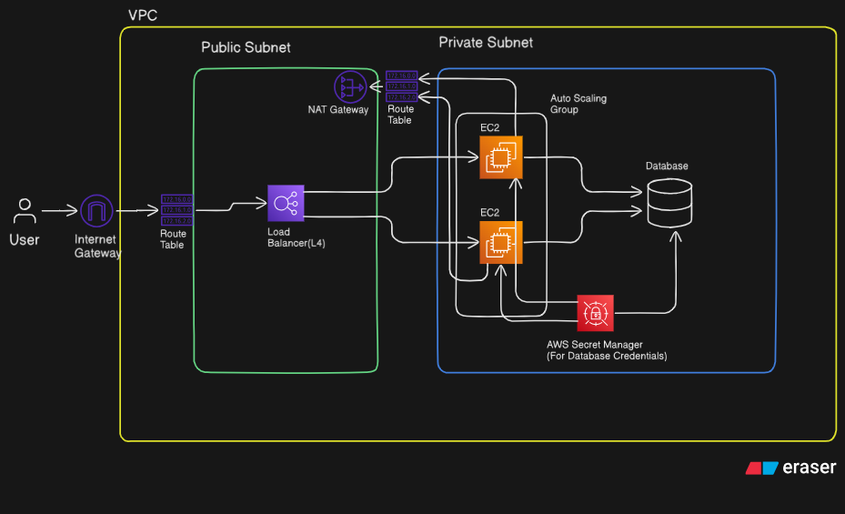

# End-to-End DevOps Pipeline & Cloud Infrastructure (AWS)

This repository demonstrates a **production-grade DevOps implementation** for a 2-tier web application. The primary focus of this project is to showcase **Infrastructure as Code (IaC)**, **CICD Automation**, and **Secure Cloud Architecture** using AWS and Terraform.

The workload deployed is "PrimeDeal" (a MERN (M-MySQL) stack e-commerce app), but the infrastructure is agnostic and designed to host any containerized application.

## 🌐 Live Access

You can access the deployed application here:
**URL:** [http://primedeal-nlb-v2-9dddf95343f4af35.elb.us-east-2.amazonaws.com](http://primedeal-nlb-v2-9dddf95343f4af35.elb.us-east-2.amazonaws.com)

---
---

## 🏗 Architecture Overview

The infrastructure is provisioned completely via **Terraform** on **AWS** (us-east-2), following the **Well-Architected Framework** pillars of Security and Reliability.

### High-Level Architecture
*   **VPC**: Custom Virtual Private Cloud with strict network isolation.
*   **Public/Private Subnets**:
    *   **Public**: Hosts the Network Load Balancer (ALB) and NAT Gateways.
    *   **Private**: Hosts the Application (EC2 in ASG) and Database (RDS), inaccessible from the public internet.
*   **Compute**: **Auto Scaling Group (ASG)** of `t3.micro` instances running Docker.
*   **Data Layer**: **Amazon RDS (MySQL)** for persistent relational data.
*   **Security**:
    *   **AWS Secrets Manager**: Injects sensitive credentials (DB passwords, API keys) at runtime.
    *   **IAM Roles**: Least-privilege access policies attached to EC2 instances.
    *   **Security Groups**: Minimal port exposure (Workload only accepts traffic from NLB).

### Architecture Diagram

---

## 🔄 CI/CD Pipeline (GitHub Actions)

The pipeline is fully automated using GitHub Actions, separated into two distinct workflows for proper **Separation of Concerns**.

### 1. Continuous Integration (CI)
**Goal**: Validate code quality and produce a deployable artifact.
*   **Trigger**: Push to `main`.
*   **Steps**:
    1.  **Environment Setup**: Node.js & NPM cache.
    2.  **Test**: Runs `jest` (Unit/Integration tests).
    3.  **Build**: Compiles the Docker image.
    4.  **Publish**: Pushes the image to **Docker Hub** tagged with the Git SHA (`${{ github.sha }}`) for traceability.

### 2. Continuous Deployment (CD)
**Goal**: Provision infrastructure and update the running application with zero downtime.
*   **Trigger**: Successful completion of the CI workflow.
*   **Steps**:
    1.  **Configure AWS Credentials**: OIDC authentication for security.
    2.  **Terraform Init**: Initializes backend using **S3** (State Storage) and **DynamoDB** (State Locking).
    3.  **Terraform Apply**:
        *   Updates the **Launch Template** with the new Docker image tag from CI.
        *   Refreshes the State file.
    4.  **Rolling Deployment**:
        *   Triggers an **Instance Refresh** on the Auto Scaling Group.
        *   AWS gracefully terminates old instances and spins up new ones with the updated code.
        *   **Zero Downtime**: The Load Balancer ensures traffic is only routed to healthy, updated instances.

---

## 🛠 DevOps Toolchain

| Category | Tool | Usage |
| :--- | :--- | :--- |
| **IaC** | **Terraform** | Provisioning VPC, EC2, RDS, SG, IAM, etc. |
| **CI/CD** | **GitHub Actions** | Orchestrating the build and deploy pipelines. |
| **Containerization** | **Docker** | Packaging the application for consistent runtime. |
| **Cloud Provider** | **AWS** | Hosting infrastructure (US-East-2). |
| **Secrets Management** | **AWS Secrets Manager** | Securely injecting Env Vars into Containers. |
| **State Management** | **AWS S3 + DynamoDB** | Remote Terraform state storage and locking. |

---

## 🔐 Security & "Production-Ready" Features

1.  **No Hardcoded Secrets**: All sensitive data (Database URL, API Keys) is fetched from **AWS Secrets Manager** during the instance boot process (`user_data.sh`). The source code contains no `.env` files.
2.  **Remote State**: Terraform state is stored remotely in an encrypted S3 bucket with DynamoDB locking to prevent race conditions during team deployments.
3.  **Private Subnets**: The application servers and database have **no public IP addresses**. They communicate with the internet solely through a NAT Gateway for updates.
4.  **Immutable Infrastructure**: We do not patch servers. Every deployment creates fresh instances from a standardized AMI.

---

## 📦 usage (The Workload)
The deployed application is **PrimeDeal**, full-stack MERN e-commerce platform.
*   **Frontend**: React
*   **Backend**: Node.js + Express 
*   **DB**: MySQL (RDS)

---
*DevOps Project by Deepanshu Saini*

